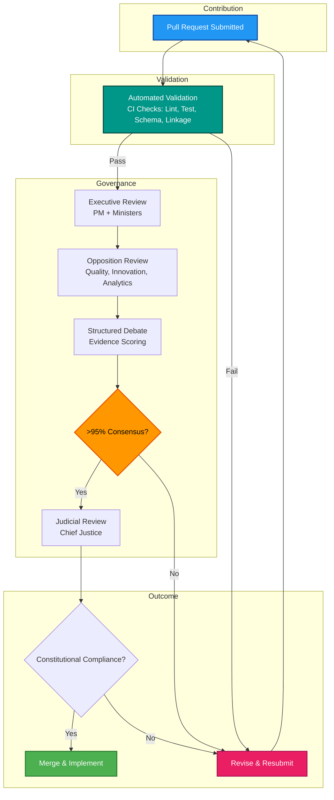

# Contributing to AegisIDE

**Democratic Parliamentary Governance** (98% autonomous operation, 16 constitutional articles)

## Democratic Contribution Workflow



## Tri-Branch Parliamentary System

### Executive Branch (Government)
- **Project Manager**: Strategic coordination, consensus building
- **Development Minister**: Implementation, code quality
- **Technology Minister**: Technical architecture, system design

### Development Workflow

```bash
# Initialize project (first time OR restore session)
init

# Execute autonomous tasks
next
```

### Legislative Branch (Opposition)
- **Quality Shadow**: Testing, quality assurance, challenges
- **Innovation Shadow**: Alternative approaches, research
- **Analytics Shadow**: Data-driven validation, metrics

### Judicial Branch
- **Chief Justice**: Constitutional compliance, final review authority

## 7-Step Democratic Process

1. **Proposal** → Submit PR with impact assessment
2. **Opposition Review** → Shadows challenge with evidence
3. **Structured Debate** → Evidence-based discussion
4. **Evidence Scoring** → Weighted consensus calculation
5. **>95% Consensus** → Democratic approval required
6. **Judicial Review** → Constitutional compliance validation
7. **Implementation** → Merge and execute with monitoring

## 6 Core Protocols (MANDATORY)

All contributions MUST implement these protocols:

1. **Anti-Duplication Protocol**: NEVER recreate existing centralized configs
2. **File Editing Hierarchy**: Direct Edit → Filesystem MCP → Terminal
3. **Session Continuity**: Auto-checkpoint, auto-resume every 10 tasks
4. **Multi-Language Validation**: HALT-FIX-VALIDATE loop (10+ languages)
5. **Pattern Recognition**: Auto-execute recommendations without asking
6. **Autonomous Startup**: 5-step protocol on every user message

## Contribution Guidelines

### Code Standards
- **EMD Compliance**: ≤80 lines per code file, deep nested structure
- **Memory-Bank JSON Files**: ≤10KB each (8 essential JSON files for optimal parsing)
- **Roadmap**: roadmap.json ≤20KB, roadmap.md ≤12,000 characters (human-readable)
- **Schema Validation**: All JSON files validated against `core/schemas/` on read/write
- **Constitutional Compliance**: ≥80% framework adherence with tri-branch oversight
- **File Editing**: ALWAYS check existence, use `replace_file_content` for existing files

### Testing Requirements
- Unit tests for new features
- Integration tests for system changes
- Constitutional compliance validation
- Cross-platform compatibility (8 IDEs)

### Documentation
- Update relevant platform READMEs
- Add entries to CHANGELOG.md
- Update constitutional articles if needed
- Include mermaid diagrams for workflows

## Pull Request Checklist

- [ ] Code follows EMD standards (≤80 lines/file)
- [ ] JSON files follow schema (≤10KB each with validation)
- [ ] All 8 essential memory-bank files updated if changed
- [ ] Tests included and passing with language-specific validation
- [ ] Documentation updated with JSON-first references
- [ ] Constitutional compliance verified (≥80% adherence)
- [ ] Tri-branch consensus achieved (>95% weighted approval)
- [ ] Cross-platform tested (if applicable, 8 IDEs supported)
- [ ] CHANGELOG.md updated with version and date
- [ ] Tri-branch review completed
- [ ] >95% consensus achieved
- [ ] Judicial review passed

## Getting Started

1. Fork repository
2. Create feature branch
3. Make changes following standards
4. Run constitutional validation
5. Submit PR with detailed description
6. Engage in democratic review process
7. Address feedback from all branches
8. Achieve >95% consensus
9. Pass judicial review
10. Celebrate merge!

## Constitutional References

- **Framework**: [core/constitution/](core/constitution/) - 16 Articles
- **Global Rules**: [platforms/windsurf/global_rules.md](platforms/windsurf/global_rules.md)
- **Platform Guides**: [platforms/](platforms/) - 8 implementations

## Community

- **GitHub**: [AegisIDE Repository](https://github.com/Gaurav-Wankhede/AegisIDE)
- **Issues**: Report bugs, request features
- **Discussions**: Ask questions, share ideas
- **Security**: See [SECURITY.md](SECURITY.md)

## License

MIT License - See [LICENSE.md](LICENSE.md)

---

**Thank you for contributing to democratic AI development!**
