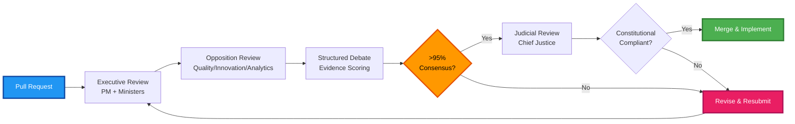

# Contributing to AegisIDE

**Democratic Parliamentary Governance** (98% autonomous operation, 13 constitutional articles)

## Democratic Contribution Workflow

## Tri-Branch Parliamentary System

### Executive Branch (Government)
- **Project Manager**: Strategic coordination, consensus building
- **Development Minister**: Implementation, code quality
- **Technology Minister**: Technical architecture, system design

### Legislative Branch (Opposition)
- **Quality Shadow**: Testing, quality assurance, challenges
- **Innovation Shadow**: Alternative approaches, research
- **Analytics Shadow**: Data-driven validation, metrics

### Judicial Branch
- **Chief Justice**: Constitutional compliance, final review authority

## 7-Step Democratic Process

1. **Proposal** → Submit PR with impact assessment
2. **Opposition Review** → Shadows challenge with evidence
3. **Structured Debate** → Evidence-based discussion
4. **Evidence Scoring** → Weighted consensus calculation
5. **>95% Consensus** → Democratic approval required
6. **Judicial Review** → Constitutional compliance validation
7. **Implementation** → Merge and execute with monitoring

## Contribution Guidelines

### Code Standards
- **EMD Compliance**: ≤80 lines per file, deep nested structure
- **Memory-Bank**: ≤100 lines per file
- **Roadmap**: ≤200 lines, ≤12,000 characters
- **Constitutional Compliance**: ≥80% framework adherence

### Testing Requirements
- Unit tests for new features
- Integration tests for system changes
- Constitutional compliance validation
- Cross-platform compatibility (8 IDEs)

### Documentation
- Update relevant platform READMEs
- Add entries to CHANGELOG.md
- Update constitutional articles if needed
- Include mermaid diagrams for workflows

## Pull Request Checklist

- [ ] Code follows EMD standards (≤80 lines/file)
- [ ] Tests included and passing
- [ ] Documentation updated
- [ ] Constitutional compliance verified (≥80%)
- [ ] Cross-platform tested (if applicable)
- [ ] CHANGELOG.md updated
- [ ] Tri-branch review completed
- [ ] >95% consensus achieved
- [ ] Judicial review passed

## Getting Started

1. Fork repository
2. Create feature branch
3. Make changes following standards
4. Run constitutional validation
5. Submit PR with detailed description
6. Engage in democratic review process
7. Address feedback from all branches
8. Achieve >95% consensus
9. Pass judicial review
10. Celebrate merge! 🎉

## Constitutional References

- **Framework**: [core/constitution/](core/constitution/) - 13 Articles
- **Global Rules**: [platforms/windsurf/global_rules.md](platforms/windsurf/global_rules.md)
- **Platform Guides**: [platforms/](platforms/) - 8 implementations

## Community

- **GitHub**: [AegisIDE Repository](https://github.com/Gaurav-Wankhede/AegisIDE)
- **Issues**: Report bugs, request features
- **Discussions**: Ask questions, share ideas
- **Security**: See [SECURITY.md](SECURITY.md)

## License

MIT License - See [LICENSE.md](LICENSE.md)

---

**Thank you for contributing to democratic AI development!** 🏛️
