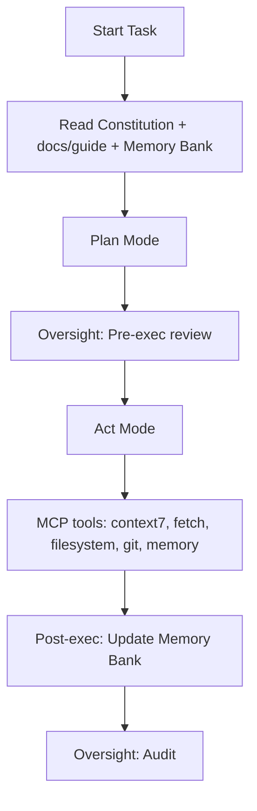
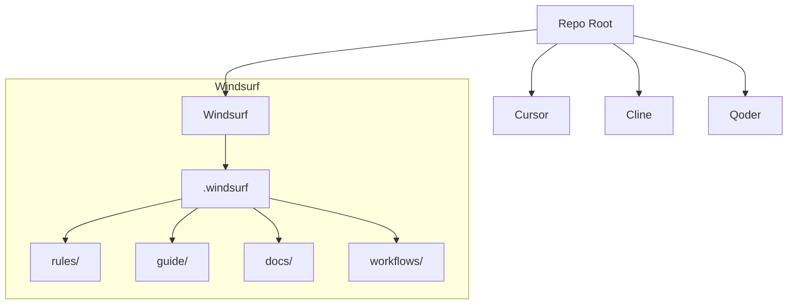

# Constitutional Framework for Agentic IDE
 [](LICENSE.md) [](docs/)
> Getting Started: [Windsurf CheatSheet](windsurf/CheatSheet.md) • [Cursor CheatSheet](cursor/CheatSheet.md) • [Cline CheatSheet](cline/CheatSheet.md) • [Qoder CheatSheet](qoder/CheatSheet.md)

## Table of Contents
- [Why this framework](#why-this-framework)
- [Benefits](#benefits)
- [How It Works](#how-it-works)
- [Autonomous Workflow: Commands](#autonomous-workflow-commands)
- [How to Use](#how-to-use)
- [Cheat Sheets](#cheat-sheets)
- [Repository Structure](#repository-structure)
- [Citations and Context7](#citations-and-context7)
- [Acknowledgments & Heritage](#acknowledgments--heritage)
- [Best Practices](#best-practices)
- [Key Commands](#key-commands)
- [Documentation Flow](#documentation-flow)
- [Contributing & Security](#contributing--security)
- [Branding](#branding)
- [Maintainer](#maintainer)
- [License](#license)

This is an open-source, IDE-agnostic constitutional framework that governs AI agent behavior inside developer tools. It codifies a separation of powers:

- Constitution (immutable rules and protocols)
- Executive (Memory Bank: global rules, active context, progress)
- Oversight (Checks & Balances workflows)

This structure reduces hallucinations, enforces repeatability, and boosts efficiency across Windsurf, Cursor, Cline, Qoder, and other IDEs.

## Why this framework
- Enforces always-on governance and validation
- Standardizes MCP tool usage and safety
- Scales across IDEs with a common template
- Encourages transparent decision-making and citations

## Benefits
- Governance-first workflows reduce hallucinations and scope drift
- Repeatable execution via Plan → Act → Oversight lifecycle
- Cross‑IDE portability (Windsurf, Cursor, Cline, Qoder) using per‑IDE rules and Memory Bank
- Safer tool usage with clear guardrails and validation steps
- Faster onboarding with ready‑to‑use templates and cheat sheets
- Documentation discipline: Global Rules + Memory Bank keep context durable across sessions

## How It Works
- Plan Mode: Load Constitution + docs/guide + Memory Bank → develop a plan
- Act Mode: Execute with MCP tools → validate → update Memory Bank
- Oversight: Pre/During/Post checks ensure constitutional compliance



## Autonomous Workflow: Commands
- Copy the IDE config folder into your project root (e.g., `windsurf/.windsurf/`, `cursor/.cursor/`, `cline/.clinerules/`, `qoder/.qoder/`). Then use these prompts:

| Command | What it does | Tools |
|---|---|---|
| "follow your custom instructions" | Load Constitution + Memory Bank (use Context7 for docs when needed) | context7 |
| "Plan Mode: <your goal>" | Generate comprehensive plan grounded in rules and documentation | sequential-thinking + context7 |
| "run pre-oversight" | Constitutional review and validation before execution | sequential-thinking |
| "review" | Check and balance RULEs in `/rules/constitution.md` and `/rules/rules.xml` | sequential-thinking + context7 + github |
| "Act Mode: execute step 1" | Perform the first step with full context; repeat for subsequent steps | github + context7 |
| "implement next task" | Execute the next immediate task (executes immediately; will proceed to make changes and run tools) | github + context7 + sequential-thinking |
| "what next" | Provide non‑executing next steps and strategy (planning only) | sequential-thinking |
| "solve lint" | Identify and fix linting issues | context7 + github |
| "solve error" | Resolve compilation/runtime errors | context7 + sequential-thinking + github |
| "fix issues" | Comprehensive scan and resolution of code issues | context7 + sequential-thinking + github |
| "research <topic>" | Gather external information and documentation | fetch + context7 + sequential-thinking |
| "test workflow" | Validate application behavior through browser automation | playwright + github |
| "update memory bank" | Update ALL Memory Bank files (`projectbrief.md`, `productContext.md`, `activeContext.md`, `systemPatterns.md`, `techContext.md`, `progress.md`, `mistakes.md`) | github |
| "check memory bank status" | Summarize memory bank state | github + context7 |
| "sync docs to memory bank" | Review docs and guide folders for your IDE config and update Memory Bank | github + context7 |
| "update docs and guide" | Update documentation in your IDE config's docs/ and guide/ | github + context7 |
| "run post-oversight" | Execution audit and lessons learned after completion | sequential-thinking + github |

## How to Use
1) Choose your IDE: `windsurf/`, `cursor/`, `cline/`, or `qoder/`.
2) Copy the hidden config folder (e.g., `windsurf/.windsurf/`) into your target project root.
3) Read the IDE‑specific `README.md` and `global_rules.md` in this repo to understand expectations.
4) In your IDE chat, paste: "follow your custom instructions" → then "Plan Mode: <your goal>" → then "Act Mode: execute step 1".
5) Use Oversight: run "run pre-oversight" before major work and "run post-oversight" after completion.
6) Keep the Memory Bank up to date with "update memory bank" (updates `activeContext.md`/`progress.md` and more).
7) Add official documentation links under your IDE config's `guide/index.md` to power Context7/fetch operations.
8) Use the per‑IDE Cheat Sheets for quick commands (links below).

## Cheat Sheets
- Windsurf: [windsurf/CheatSheet.md](windsurf/CheatSheet.md)
- Cursor: [cursor/CheatSheet.md](cursor/CheatSheet.md)
- Cline: [cline/CheatSheet.md](cline/CheatSheet.md)
- Qoder: [qoder/CheatSheet.md](qoder/CheatSheet.md)

## Repository Structure

```
Constitutional_framework_for_Agentic_IDE/
  README.md
  windsurf/
    README.md
    global_rules.md
    .windsurf/
      rules/
      guide/
      docs/
      workflows/
  cursor/
    README.md
    global_rules.md
    .cursor/
      rules/
      guide/
      docs/
      workflows/
  cline/
    README.md
    global_rules.md
    .clinerules/
      rules/
      guide/
      docs/
      workflows/
  qoder/
    README.md
    global_rules.md
    .qoder/
      rules/
      guide/
      docs/
      workflows/
```



## Citations and Context7
- Use official sources and include URLs in `guide/index.md`.
- For Context7, prefer library IDs when available (e.g., `/vercel/next.js`).

## Acknowledgments & Heritage
This framework is an enhancement over the Cline Memory Bank model. Full credit to the Cline project for pioneering the Memory Bank pattern and documentation style. We align with that style (Quick Setup Guide, Best Practices, Key Commands, Documentation Flow) while extending it across multiple IDEs under a constitutional governance model.

References:
- Cline Memory Bank (GitHub): https://github.com/nickbaumann98/cline_docs/blob/main/prompting/custom%20instructions%20library/cline-memory-bank.md
- Cline Docs (GitHub root): https://github.com/nickbaumann98/cline_docs/blob/main/README.md
- Current maintained Cline Memory Bank docs: https://docs.cline.bot/improving-your-prompting-skills/cline-memory-bank

## Best Practices
- Use Plan Mode for strategy; Act Mode for implementation
- Always read Constitution + `guide/` + `docs/` + Memory Bank before acting
- Parallelize reads/search only; never parallelize writes
- Keep `activeContext.md` and `progress.md` up to date
- Cite official sources in `guide/index.md` for Context7/fetch
- Use the Oversight workflow for pre/during/post execution checks

## Documentation Flow
- `projectbrief.md` — foundation and scope
- `productContext.md` — problem, goals, UX expectations
- `systemPatterns.md` — architecture, decisions, patterns
- `techContext.md` — stack, dependencies, constraints
- `activeContext.md` — current focus, recent changes, next steps
- `progress.md` — what works, milestones, status
- `*/global_rules.md` — per‑IDE Project Intelligence (learning journal)

## Contributing & Security
See `CONTRIBUTING.md` for workflow and PR checklist, `CODE_OF_CONDUCT.md` for behavior standards, and `SECURITY.md` for reporting guidelines. For constitution template usage and environment restrictions, see `docs/CONTRIBUTOR_GUIDE_CONSTITUTION_TEMPLATES.md`.

## Branding
Official brand: Constitutional Framework for Agentic IDE

## Maintainer
- Portfolio: https://gaurav-wankhede.vercel.app
- LinkedIn: https://www.linkedin.com/in/wankhede-gaurav
- X: https://x.com/GTechverse16703

## License
This project is licensed under the MIT License. See `LICENSE.md`.