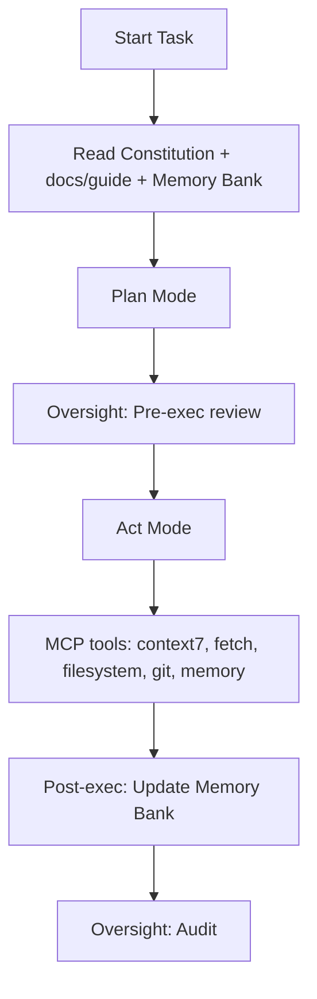
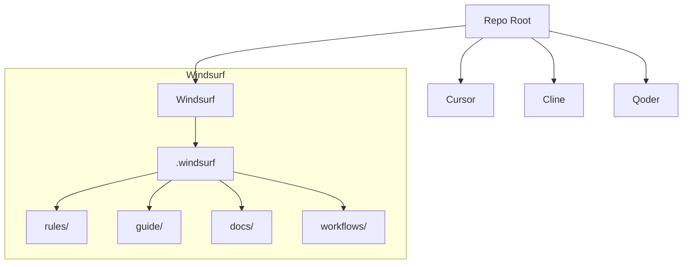

# Constitutional Framework for Agentic IDE
 [](LICENSE.md) [](docs/)
This is an open-source, IDE-agnostic constitutional framework that governs AI agent behavior inside developer tools. It codifies a separation of powers:

- Constitution (immutable rules and protocols)
- Executive (Memory Bank: global rules, active context, progress)
- Oversight (Checks & Balances workflows)

This structure reduces hallucinations, enforces repeatability, and boosts efficiency across Windsurf, Cursor, Cline, Qoder, and other IDEs.

## Why this framework
- Enforces always-on governance and validation
- Standardizes MCP tool usage and safety
- Scales across IDEs with a common template
- Encourages transparent decision-making and citations

## How It Works
- Plan Mode: Load Constitution + docs/guide + Memory Bank → develop a plan
- Act Mode: Execute with MCP tools → validate → update Memory Bank
- Oversight: Pre/During/Post checks ensure constitutional compliance



## Autonomous Workflow: Commands
- Copy the IDE config folder into your project root (e.g., `windsurf/.windsurf/`, `cursor/.cursor/`, `cline/.clinerules/`, `qoder/.qoder/`).
- In your IDE chat, issue these prompts:
  - "follow your custom instructions" — load Constitution + `guide/` + `docs/` + Memory Bank.
  - "Plan Mode: <your goal>" — generate a plan grounded in rules and docs.
  - "run oversight checks-and-balances" — pre-exec constitutional review.
  - "Act Mode: execute step 1" — perform the first step; repeat for subsequent steps.
  - "update memory bank" — write back decisions and changes (`activeContext.md`, `progress.md`).
  - "run oversight checks-and-balances" — post-exec audit to minimize hallucinations.

## Repository Structure

```
Constitutional_framework_for_Agentic_IDE/
  README.md
  windsurf/
    README.md
    global_rules.md
    .windsurf/
      rules/
      guide/
      docs/
      workflows/
  cursor/
    README.md
    global_rules.md
    .cursor/
      rules/
      guide/
      docs/
      workflows/
  cline/
    README.md
    global_rules.md
    .clinerules/
      rules/
      guide/
      docs/
      workflows/
  qoder/
    README.md
    global_rules.md
    .qoder/
      rules/
      guide/
      docs/
      workflows/
```



## Quickstart
1) Pick your IDE folder (e.g., `windsurf/`).
2) Copy the hidden config folder (e.g., `windsurf/.windsurf/`) into your project root.
3) Read the IDE-specific `README.md` and `global_rules.md`.
4) Use the Oversight workflow in `workflows/oversight-checks-and-balances.md`.
5) Add citations in `guide/` so Context7 and fetch can leverage official docs.

## Citations and Context7
- Use official sources and include URLs in `guide/index.md`.
- For Context7, prefer library IDs when available (e.g., `/vercel/next.js`).

## Acknowledgments & Heritage
This framework is an enhancement over the Cline Memory Bank model. Full credit to the Cline project for pioneering the Memory Bank pattern and documentation style. We align with that style (Quick Setup Guide, Best Practices, Key Commands, Documentation Flow) while extending it across multiple IDEs under a constitutional governance model.

References:
- Cline Memory Bank (GitHub): https://github.com/nickbaumann98/cline_docs/blob/main/prompting/custom%20instructions%20library/cline-memory-bank.md
- Cline Docs (GitHub root): https://github.com/nickbaumann98/cline_docs/blob/main/README.md
- Current maintained Cline Memory Bank docs: https://docs.cline.bot/improving-your-prompting-skills/cline-memory-bank

## Best Practices
- Use Plan Mode for strategy; Act Mode for implementation
- Always read Constitution + `guide/` + `docs/` + Memory Bank before acting
- Parallelize reads/search only; never parallelize writes
- Keep `activeContext.md` and `progress.md` up to date
- Cite official sources in `guide/index.md` for Context7/fetch
- Use the Oversight workflow for pre/during/post execution checks

## Key Commands (assistant prompts)
- "follow your custom instructions" — load Constitution + docs/guide + Memory Bank
- "initialize memory bank" — create baseline structure/files
- "update memory bank" — full documentation review and refresh
- "Plan Mode" / "Act Mode" — switch operating modes explicitly

## Documentation Flow
- `projectbrief.md` — foundation and scope
- `productContext.md` — problem, goals, UX expectations
- `systemPatterns.md` — architecture, decisions, patterns
- `techContext.md` — stack, dependencies, constraints
- `activeContext.md` — current focus, recent changes, next steps
- `progress.md` — what works, milestones, status
- `*/global_rules.md` — per‑IDE Project Intelligence (learning journal)

## Contributing & Security
See `CONTRIBUTING.md` for workflow and PR checklist, `CODE_OF_CONDUCT.md` for behavior standards, and `SECURITY.md` for reporting guidelines. For constitution template usage and environment restrictions, see `docs/CONTRIBUTOR_GUIDE_CONSTITUTION_TEMPLATES.md`.

## Branding
Official brand: Constitutional Framework for Agentic IDE

## Maintainer
- Portfolio: https://gaurav-wankhede.vercel.app
- LinkedIn: https://www.linkedin.com/in/wankhede-gaurav
- X: https://x.com/GTechverse16703

## License
This project is licensed under the MIT License. See `LICENSE.md`.