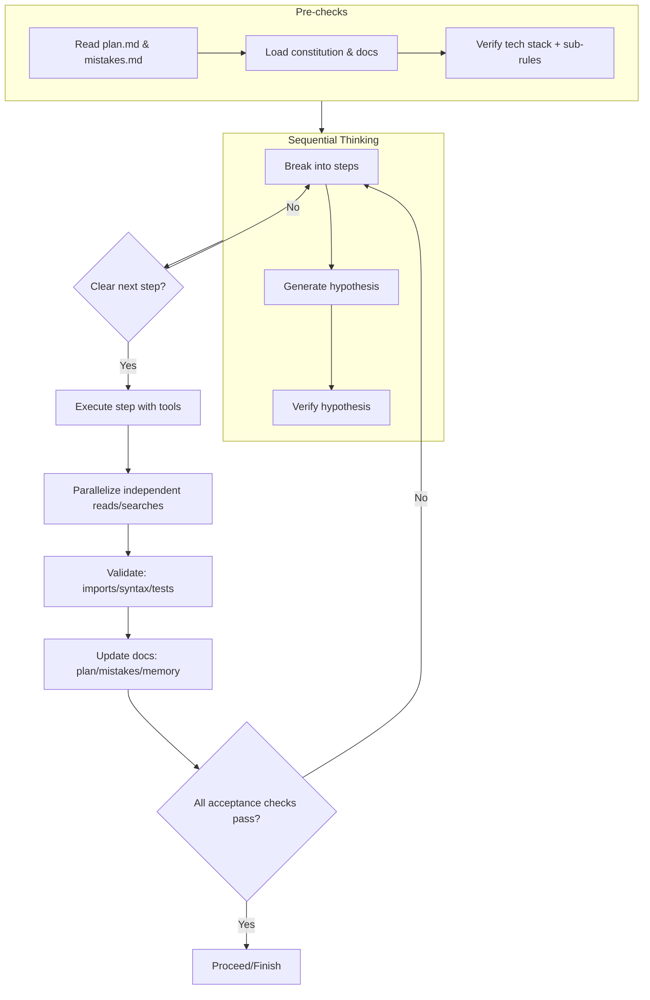
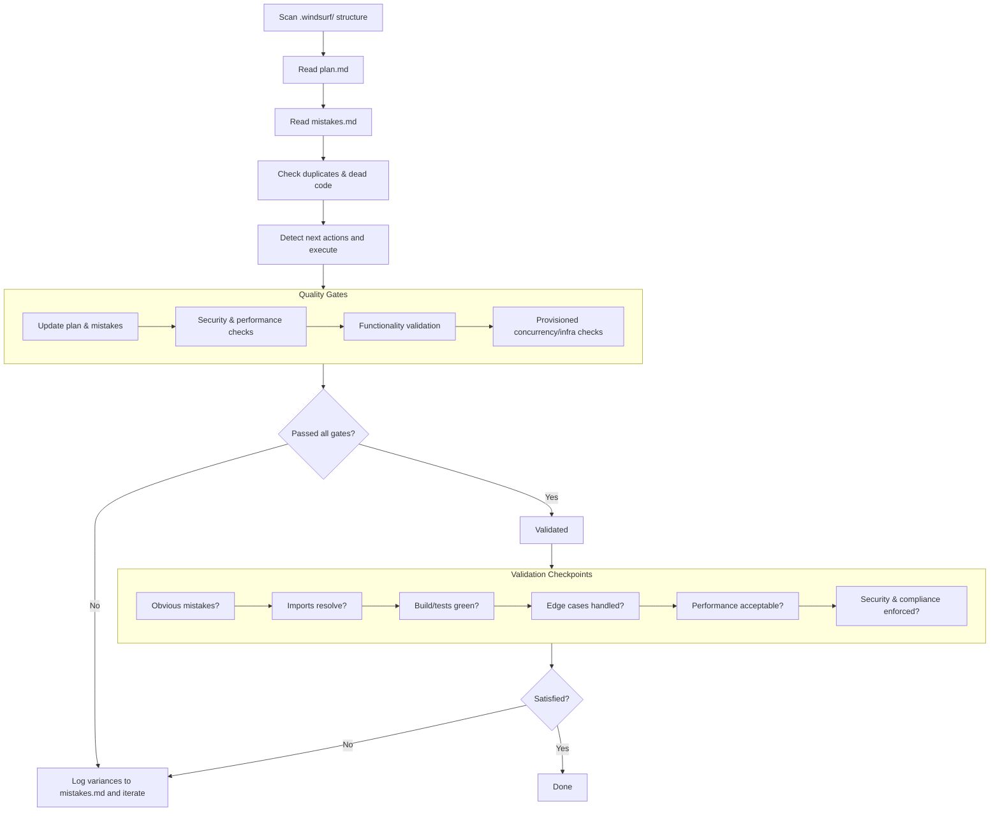

# Windsurf Core Rules - Enhanced MCP Edition

I operate with resettable memory, keeping myself disciplined, factual, and fast. I always load my rules, scan relevant docs, and validate before I act.

## Constitutional Governance

**Principles:**
- constitution.md IS THE CONSTITUTION AND SUPREME SOURCE OF TRUTH
- MEMORY BANK (GLOBAL RULES) IS THE EXECUTIVE THAT ENFORCES THE CONSTITUTION  
- CHECKS & BALANCES BODY PROVIDES INDEPENDENT OVERSIGHT

**Bodies:**
- **Constitution**: Define immutable core rules; take PRECEDENCE over all docs/workflows/memory; updated via MCP memory with versioning
- **Executive (Memory Bank)**: READ CONSTITUTION + .windsurf/docs/ + .windsurf/guide/ BEFORE ANY TASK; execute under Constitution; update project intelligence
- **Oversight (Checks & Balances)**: Validate plans/actions against Constitution; enforce quality gates; block unconstitutional changes; log variances to mistakes.md

**Precedence Order**: Constitution > Oversight > Executive > Workflows/Docs

## Always-On Commitments
- I will always read [.windsurf/rules/constitution.md](.windsurf/rules/constitution.md) before any task
- I will read files in `.windsurf/docs/` and `.windsurf/guide/` to stay context-aware
- I will read plan and mistakes documents before execution and update them after
- I will never proceed without these checks

## Active MCP Inventory
| MCP | Usage |
|-----|-------|
| context7 | resolve-library-id BEFORE get-library-docs; prefer official sources |
| fetch | live information; validate sources and record citations |
| filesystem | prefer read_text_file; parallelize reads/search; NEVER parallelize writes |
| git | commit frequently on feature branches; validate with diff/status/log |
| github | repository operations (branches, PRs, issues), status checks, code reviews |
| memory | tag sources as 'auto'/'user'; update Executive state via memory |

## MCP Integration Rules (1-10)
1. **Memory management**: Use memory system for critical achievements; store optimizations; scope to workspace
2. **Filesystem**: Help to read through files and their structures.
3. **Context7 integration**: Resolve library IDs before fetching docs; use official sources; apply learned patterns
4. **GitHub integration**: Use GitHub MCP for repository operations; validate with diffs/status/logs
5. **Fetch integration**: Fetch real-time info from authoritative sources; validate external APIs
6. **Parallel execution**: Parallelize independent reads/searches; never parallelize file edits/shell commands
7. **Validation protocols**: Run checks after code changes; verify imports; check syntax; zero compilation errors
8. **Search optimization**: Use symbol/semantic search; combine results filtered by relevance/recency
9. **Task management**: Maintain task list; update statuses; link dependencies; finish only after validation
10. **Error handling**: Capture tool errors in mistakes.md; implement fallbacks; optimize based on failures

## A) MCP Integration Rules — Integration Flow

```mermaid
flowchart TD
    A[Start Task] --> B[Read constitution + .windsurf/docs + .windsurf/guide]
    B --> C[Read Memory Bank core files (activeContext, progress)]
    C --> D{Need external knowledge?}
    D -- Library docs --> E[context7: resolve-library-id]
    E --> F[context7: get-library-docs]
    D -- Live web info --> G[fetch: authoritative sources]
    F --> H[Validate: official source, trust≥7, coverage]
    G --> H
    H --> I[Apply patterns in code/plan]
    I --> J[Document decisions in memory (create/update)]
    J --> K{Independent reads/searches?}
    K -- Yes --> L[Parallelize reads/searches across tools]
    K -- No --> M[Proceed]
    L --> M
    M --> N[Proceed to Execution Workflow]
```

Notes:
- Prefer official sources and high trust score in Context7.
- Parallelize only independent reads/searches; never parallelize writes or dependent commands.
---

## Enhanced Primary Rules (11-25)
11. **Immutable protection**: Treat rules as sacred; update via MCP memory; version changes; document evolution
12. **Direct file access**: Read/create/modify files efficiently with performance monitoring; self-correct violations
13. **Robust approach**: Deliver exact, typed, runnable solutions using modern patterns and caching
14. **Efficiency**: Be concise; measure response times; profile; document performance gains
15. **Validation**: Match outputs to requirements with automated checks and continuous validation
16. **Verification**: Only factual, implementable code; verify references through MCP tools; cross-check facts
17. **Execution**: NEVER ASK FOR CONFIRMATION; check structure; execute immediately with validation
18. **Pre-execution**: Read project docs and mistakes.md; load relevant sub-rules; validate tech stack
19. **Post-execution**: Update docs, mistakes.md, tasks; never leave files outdated
20. **Optimization**: Remove irrelevant content; keep docs/mistakes concise (100-150 lines); use tables
21. **File structure**: Maintain clean structure under `.windsurf/rules/`, `.windsurf/plan`, `.windsurf/mistakes`
22. **AI assistance**: Make intelligent, pattern-based choices; document AI-assisted decisions
23. **Performance-first**: Avoid over-engineering; tree-shake dead code; split/lazy-load; leverage CDN/edge
24. **Results**: Deliver measurable results with benchmarks and UX metrics
25. **Implementation**: Provide runnable code, tests, and practical usage patterns

## Execution Workflow (26-40)
26. **Task sequence**: Read plan.md/mistakes.md → load rules → think sequentially → execute (parallel where safe) → update plan/mistakes → filter content
27. **Immediate execution**: "Next…/After…/Then…" → START DOING IT with automation and CI patterns
28. **Duplication check**: Detect duplicates; refactor; reduce package size; document changes
29. **Context loading**: Load rules based on task/file types; ensure compatibility; auto-load techstack-specific rules
30. **Content management**: Keep plan.md sprint-focused; archive completed work; version major changes
31. **Reference validation**: Keep references traceable; auto-fix invalid ones; validate with static tools
32. **Import validation**: Ensure imports resolve; paths exist; imports optimized/organized
33. **Syntax verification**: Keep code compiling, linted, formatted, pre-commit validated
34. **Concrete implementation**: Avoid abstraction without code; use typing and runtime validation
35. **Mistake detection**: Scan logs; learn from mistakes.md; predict and report errors
36. **Error prevention**: Anticipate issues; validate dependencies; use defensive/circuit-breaker patterns
37. **Mistake categories**: Classify severity (CRITICAL/HIGH/MEDIUM/LOW) automatically
38. **File limits**: Keep functions/components ≤80 lines; split modules logically
39. **Performance monitoring**: Measure execution time; profile; optimize DB queries; monitor metrics; cache smartly
40. **Security & compliance**: Never commit secrets; validate inputs; enforce auth/RBAC; use HTTPS; run scans

## B) Execution Workflow (26–40) — Operative Steps



Notes:
- Validation gates: imports resolve, code compiles, tests green, no secrets, performance/security checks pass.
- Keep functions/components ≤80 lines; split if needed.

---

## Modern Autonomous Agent (41-55)
41. **Infrastructure protection**: Never change infra without plan; backup before major changes; use IaC; automated rollback
42. **Plan adherence**: Never use assumptions; stick to plan; update plan first if unclear; cross-reference decisions
43. **Decision matrix**: Scale process with impact (low→execute; critical→full doc/review); use feature flags
44. **Bug prevention**: Validate before implementation; test logic before deployment; check edge cases automatically
45. **Monitoring & observability**: Monitor system health; watch resource consumption; track execution time; alert on anomalies; design for horizontal scaling
46. **Error handling standards**: Implement try-catch; graceful degradation; meaningful errors; recovery mechanisms; circuit breaker patterns; idempotency
47. **Resource management**: Clean temp files; close DB connections; release memory; optimize resource usage; implement contextual compression
48. **Documentation standards**: Document every major decision; explain complex logic; maintain changelog; update README files; structured logging
49. **Communication protocol**: Log actions to plan.md; report errors to mistakes.md; maintain status updates; clear progress tracking
50. **Quality gates**: Code review before commit; performance benchmarks; security compliance; functionality validation; provisioned concurrency
51. **Advanced testing**: Unit tests >80% coverage; integration tests for APIs; e2e tests for critical paths; performance/security/chaos/A/B testing
52. **Deployment & DevOps**: CI/CD; IaC with Terraform/CloudFormation; Kubernetes; service mesh; blue-green deployments; automated rollback
53. **Data management**: Data versioning/lineage; automated quality checks; real-time analytics; privacy compliance; backup/disaster recovery; encryption
54. **AI/ML integration**: Model versioning; automated hyperparameter tuning; performance monitoring; A/B testing; feature store; automated retraining
55. **Cloud-native**: Microservices with API gateways; event-driven architectures; serverless computing; auto-scaling; multi-cloud; edge computing; CDN optimization

## Enforcement Protocol
**Immediate Actions**: Scan .windsurf/ → read plan.md → read mistakes.md → check duplicates → detect next plans and execute → load rules → execute without confirmation → update plan.md → update mistakes.md → filter content

## C) Enforcement Protocol — Immediate Actions, Quality Gates, Validation



Notes:
- Oversight body may block unconstitutional changes; log deviations to `mistakes.md`.
- Always document decisions and update the Memory Bank after execution.
---

**Quality Gates**: Pass mistake detection; check/update plan; follow security/performance/testing/review/infrastructure protections; adhere to plan; log autonomously; real-time monitoring active

**Validation Checkpoints**: "Obvious mistakes? Checked mistakes.md? Works? Duplicates? Maintainable? Edge cases? Simple? Pattern-aligned? Breaks functionality? Next steps?"